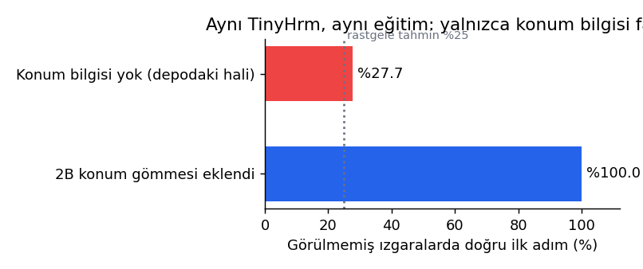

# HRM (Hierarchical Reasoning Model) - TinyHRM

Bu depo, insan beynindeki hiyerarşik düşünme (yavaş/stratejik ve hızlı/detay odaklı) mekanizmasını taklit eden **Hierarchical Reasoning Model (HRM)** mimarisinin PyTorch uygulamasını içermektedir.

## 🧠 Model Mimarisi

Model, iki seviyeli (Dual-Level) döngüsel (recurrent) akıl yürütme mimarisi üzerine kurulmuştur:

1. **SwiGLU Katmanı:**
   Modern LLM'lerde (LLaMA vb.) kullanılan kapılı aktivasyon fonksiyonu (`SiLU(W1(x)) * W2(x)`).
2. **HRMBlock:**
   Multi-Head Self-Attention, RMSNorm ve SwiGLU MLP katmanlarını rezidüel bağlantılarla birleştiren temel Transformer bloğu.
3. **ReasoningModule:**
   Birden fazla `HRMBlock` katmanını sıralı çalıştıran ve durum bilgisine girdi enjeksiyonunu (`hidden_state + input_injection`) uygulayan modül.
4. **TinyHrm (Dual-Level Reasoning):**
   * **Düşük Seviye (`L_level`):** `L_cycles` boyunca yerel ve ince adımları çözer.
   * **Yüksek Seviye (`H_level`):** `H_cycles` boyunca düşük seviyenin sentezlediği durumu alarak genel hedef ve makro stratejiyi günceller.

```python
for _ in range(self.H_cycles):
    for _ in range(self.L_cycles):
        z_L = self.L_level(z_L, z_H + x)
    z_H = self.H_level(z_H, z_L)
```

## 🎮 Örnek Görev (8x8 Izgara Yön Tahmini)

Modelin testi için 8x8'lik ızgarada `A` (başlangıç) noktasından `B` (hedef) noktasına ulaşmak için atılması gereken ilk adım yönünü (Yukarı, Aşağı, Sol, Sağ) tahmin eden bir oyuncak problem kurgulanmıştır.

* **A:** 2 (Başlangıç)
* **B:** 3 (Hedef)
* **Hücre Boyutu:** 128 embedding boyutu
* **Yön Tahmini:** `0: YUKARI, 1: AŞAĞI, 2: SOL, 3: SAĞ`

## 🚀 Çalıştırma

Gereksinimler:
```bash
pip install torch matplotlib
```

Modeli çalıştırmak ve eğitim grafiğini görmek için:
```bash
python hrm_model.py
```

---

## 🔬 Deney altyapısı (`hrm_lab/`)

`hrm_model.py`'deki `TinyHrm`, `ReasoningModule` ve `HRMBlock` sınıfları doğrudan içe aktarılır. Etraflarına görevler, eğitim döngüsü, karşılaştırma modelleri ve rapor eklenmiştir.

| Dosya | İçerik |
|---|---|
| `hrm_lab/tasks.py` | Görev üreteçleri: yön (A→B, 8×8), labirentte en kısa yol (19×19), tek çözümlü Sudoku. Hepsinin doğrulayıcısı ve veri çoğaltması var. |
| `hrm_lab/models.py` | `GridEncoder` (2B konum gömmesi) ve `HRMReasoner`. `HRMReasoner` iki eğitim biçimi sunar: `bptt` (TinyHrm.forward'ın kendisi) ve `one_step` (makaledeki tek adımlı gradyan). Karşılaştırma için `LoopedNet` ve `TransformerNet` de burada. |
| `hrm_lab/train.py` | Derin denetim (segmentler arası durum koparılır), durma başı (ACT), eşit güncelleme bütçesi. GPU sıcaklık koruması: 75°C'de eğitim bekler. |
| `run_experiments.py` / `make_report.py` | Deneyleri çalıştırır; tabloları ve `docs/figures/` altındaki grafikleri üretir. |
| `tests/` | 11 test. Sarmalayıcının birebir `TinyHrm.forward` olduğunu, tek adımlı gradyanın yalnızca son L/H adımında aktığını, konum etkisini ve üreteçlerin doğruluğunu sınar. |

```bash
pip install -r requirements.txt
python -m pytest tests -q
python run_experiments.py --task direction --methods pos_ablation
python make_report.py
```

## 📌 Bulgu 1: Dikkat katmanlarının konum bilgisi yok

`nn.MultiheadAttention` konum bilgisi taşımaz. Bu yüzden A hücresinin çıktısı, B'nin ızgarada nerede olduğundan bağımsızdır; model yalnızca belirteçlerin kümesini görür (`tests/test_hrm_lab.py` bunu sınar). Aynı `TinyHrm` ve aynı eğitimle, 2000 rastgele ızgarada eğitilip 976 görülmemiş ızgarada test edildi:

| Model | Görülmemiş ızgarada doğru ilk adım |
|---|---:|
| TinyHrm, konum bilgisi yok | %27.7 (rastgele tahmin %25) |
| TinyHrm + 2B konum gömmesi (`GridEncoder`) | **%100** |



`hrm_model.py`'deki örnek tek bir ızgarayı ezberlediği için bu durum orada görünmez. Konum, girdiye eklenir ve her L adımında girdi enjeksiyonuyla (`z_H + x`) yeniden verilir; model kodunda değişiklik gerekmez.

## 📌 Bulgu 2: Tek adımlı gradyan belleği 3.4 kat azaltır

19×19 labirent, 64'lük mini-toplu, aynı model (534 bin parametre, N=2 × T=3):

| Eğitim biçimi | Tepe GPU belleği |
|---|---:|
| BPTT (`TinyHrm.forward`, 6 L + 2 H adımının hepsi grafikte) | 3.70 GB |
| Tek adımlı gradyan (yalnızca son L ve son H adımı) | **1.08 GB** |

Bellek döngü sayısından bağımsız kalır; böylece daha uzun "düşünme" döngüleri aynı GPU'ya sığar.

## 📚 Literatür: HRM'yi ne çalıştırıyor?

- **HRM** (Wang vd., 2025): 27 milyon parametre ve görev başına yaklaşık 1000 örnekle zor Sudoku, 30×30 labirent ve ARC-AGI'de güçlü sonuçlar raporlar. Temel teknikleri iki zaman ölçekli yineleme (H yavaş, L hızlı), tek adımlı gradyan, derin denetim ve uyarlamalı durmadır (ACT). [arXiv:2506.21734](https://arxiv.org/abs/2506.21734)
- **ARC Prize analizi** (2025): Aynı boyuttaki bir Transformer, hiyerarşik mimariyle benzer sonuç verdi. Asıl kazanç dış döngüden, yani derin denetimle cevabı tekrar tekrar iyileştirmekten geliyor. [arcprize.org/blog/hrm-analysis](https://arcprize.org/blog/hrm-analysis)
- **TRM** (Jolicoeur-Martineau, 2025): Tek, 2 katmanlı ve 7 milyon parametreli bir ağ, tekrarlı iyileştirmeyle HRM'yi geçiyor: Sudoku-Extreme'de %87 (HRM %55), Maze-Hard'da %85 (HRM %75). [arXiv:2510.04871](https://arxiv.org/abs/2510.04871)

Bu yüzden `hrm_lab`, hiyerarşinin katkısını dış döngünün katkısından ayırmak için döngülü ama hiyerarşisiz bir karşılaştırma modeli (`LoopedNet`) de içerir.

## 🧭 Kullanım alanları

- **Izgarada rota planlama:** Labirent görevi, engelli bir haritada başlangıçtan hedefe en kısa yolu hücre hücre üretir. Drone ve robot rota planlamasının küçük ölçekli karşılığıdır; `tasks.check_maze_answer` üretilen yolun geçerli ve en kısa olduğunu doğrular.
- **Kısıt çözme:** Sudoku benzeri, her hücrenin diğerlerine bağlı olduğu problemler (çizelgeleme, yerleşim).
- **Az veriyle akıl yürütme:** Yaklaşık 1000 örnek ve güçlü veri çoğaltması; büyük dil modellerinin düşünce zinciri yerine sabit boyutlu, tekrarlı bir çıkarım.

Labirent ve Sudoku üreteçleri, eğitim döngüsü ve karşılaştırma modelleri hazırdır. Tam karşılaştırma şu komutla çalıştırılır:

```bash
python run_experiments.py --task maze --methods all --seeds 0 1 2
```

Uzun sürer; GPU sıcaklık koruması açıktır.
